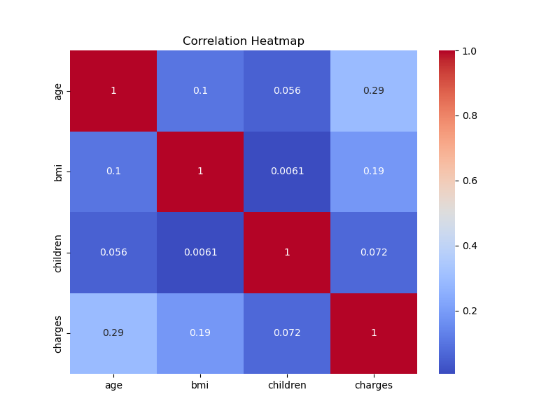
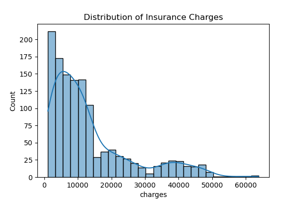
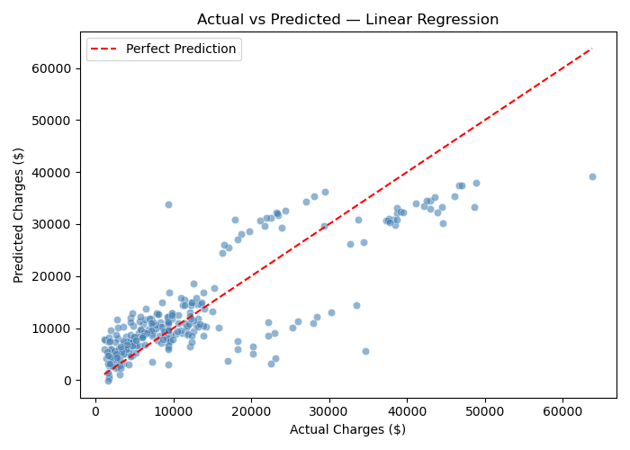

# insurance-cost-prediction
ML project to predict insurance costs
This project predicts medical insurance costs based on user attributes like age, BMI, and smoking habits using machine learning.

## ⚙️ Tech Stack
- Python
- Pandas, NumPy
- Scikit-learn
- Matplotlib, Seaborn

## 📊 Workflow
- Data preprocessing
- Exploratory Data Analysis (EDA)
- Model training (Linear Regression)
- Model evaluation (MSE, RMSE, R²)

## 📈 Results
- R² Score: ~0.709
- Model predicts insurance cost with good accuracy
## 📊 Visualizations

## 🚀 How to Run
1. Clone this repository
2. Install dependencies:
   pip install -r requirements.txt
3. Run the notebook

## 🔮 Future Improvements
- Add advanced ML models
- Deploy using Streamlit
